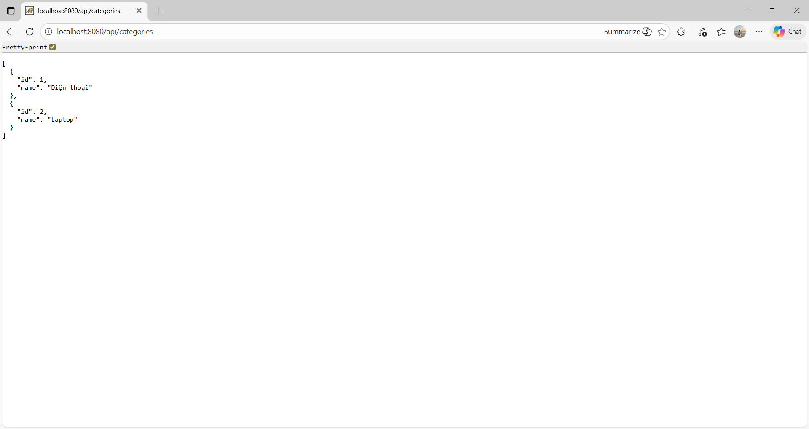
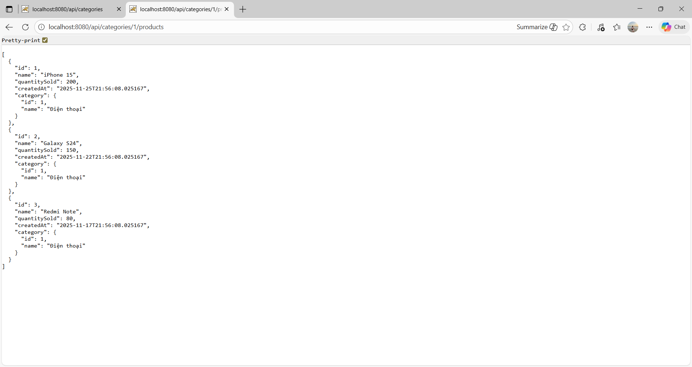
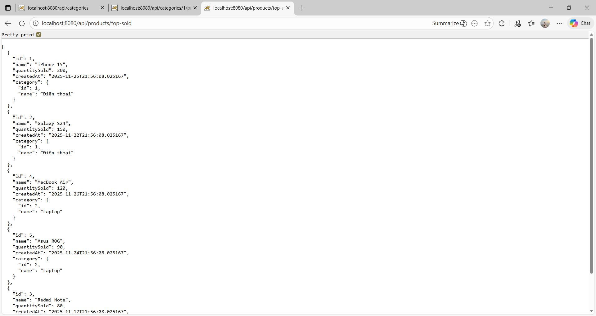
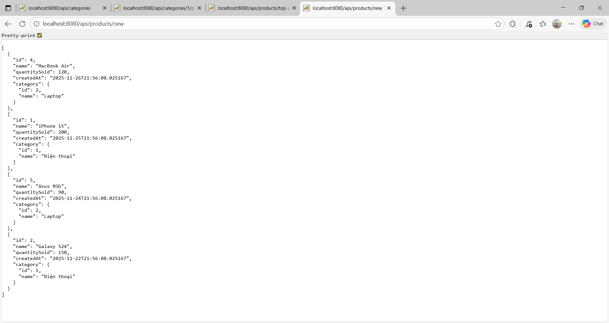
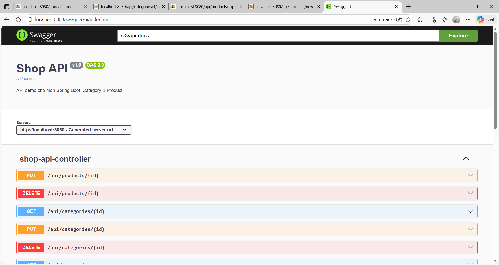
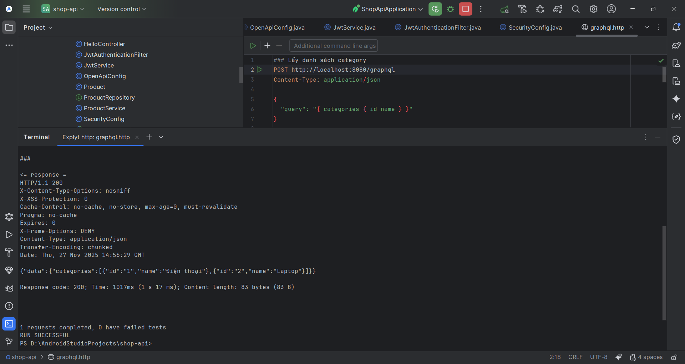
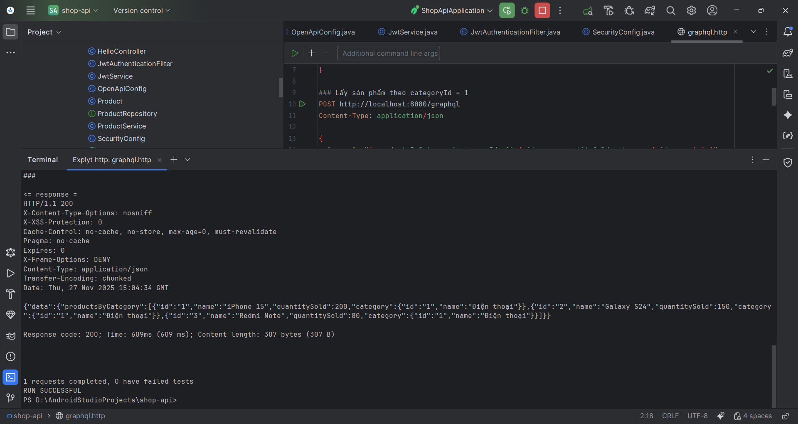
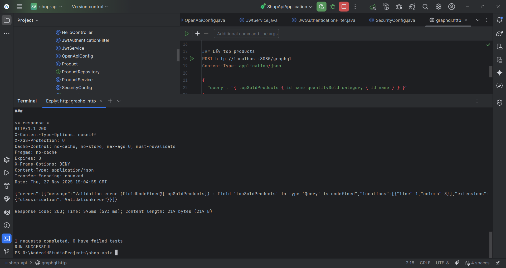
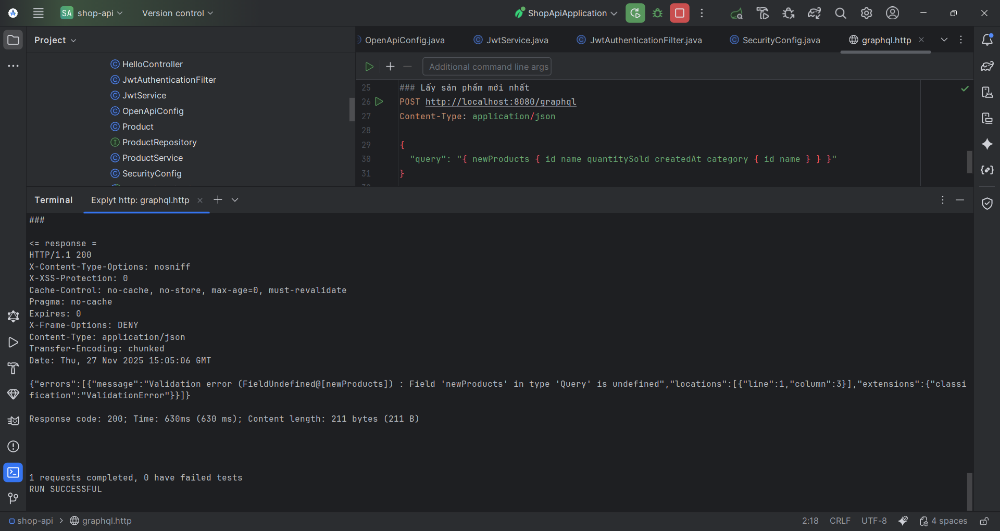

# Shop API – Spring Boot + REST + GraphQL + Swagger

Đây là project **Shop API** dùng cho môn Spring Boot.  
Ứng dụng mô phỏng hệ thống bán hàng đơn giản với 2 thực thể chính:

- `Category` – Nhóm sản phẩm (Điện thoại, Laptop, …)  
- `Product` – Sản phẩm thuộc một category, có số lượng đã bán và ngày tạo

Project minh hoạ:

- Xây dựng REST API với Spring Boot
- Sử dụng **JPA + H2** để lưu trữ dữ liệu
- Tạo tài liệu API với **Swagger / OpenAPI**
- Tạo endpoint **GraphQL** để query dữ liệu
- Thêm **Spring Security + JWT** cho chức năng login đơn giản

---

# 1. Công nghệ sử dụng

- **Java 17**
- **Spring Boot** (Spring Web, Spring Data JPA, Spring Security, Spring GraphQL)
- **H2 Database** (in–memory)
- **Lombok**
- **JWT (jjwt)** – tạo token đăng nhập
- **OpenAPI/Swagger** – tài liệu REST API
- IDE: **Android Studio / IntelliJ IDEA**

---

# 2. Cấu trúc project chính

```text
shop-api
├── build.gradle
├── src
│   └── main
│       ├── java
│       │   └── com.example.shop_api
│       │       ├── Category.java
│       │       ├── Product.java
│       │       ├── CategoryRepository.java
│       │       ├── ProductRepository.java
│       │       ├── CategoryService.java
│       │       ├── ProductService.java
│       │       ├── DataInitializer.java
│       │       ├── ShopApiController.java       (REST controller)
│       │       ├── ShopGraphQlController.java   (GraphQL controller)
│       │       ├── OpenApiConfig.java           (Swagger config)
│       │       ├── SecurityConfig.java          (Spring Security)
│       │       ├── JwtService.java
│       │       ├── JwtAuthenticationFilter.java
│       │       ├── AuthController.java          (/auth/login)
│       │       └── ShopApiApplication.java      (class main)
│       └── resources
│           ├── application.properties
│           └── graphql
│               └── schema.graphqls
└── docs
    └── screenshots
        ├── categories.png
        ├── categories_1_products.png
        ├── products_top-sold.png
        ├── products_new.png
        ├── swagger-ui_index.html.png
        ├── graphql_1.png
        ├── graphql_2.png
        ├── graphql_3.png
        └── graphql_4.png
```

---

# 3. Hướng dẫn chạy ứng dụng
Clone repo:

```
git clone https://github.com/YueLouis/shop-api.git
cd shop-api
```

Chạy ứng dụng bằng Gradle:

```
./gradlew bootRun      # Linux/Mac
```

hoặc

```
gradlew.bat bootRun    # Windows
```

Có thể chạy trực tiếp trong Android Studio / IntelliJ bằng cách run class ShopApiApplication.

Ứng dụng start trên cổng 8080:

REST API base URL: http://localhost:8080/api

Swagger UI: http://localhost:8080/swagger-ui/index.html

GraphQL endpoint: http://localhost:8080/graphql (chỉ nhận POST)

---

# 4. Dữ liệu mẫu (DataInitializer)
Khi ứng dụng khởi động, DataInitializer sẽ tự seed dữ liệu ví dụ:

Category:

1 – "Điện thoại"

2 – "Laptop"

Product (ví dụ):

iPhone 15 – thuộc “Điện thoại”, quantitySold = 200

Galaxy S24 – thuộc “Điện thoại”, quantitySold = 150

Redmi Note – thuộc “Điện thoại”, quantitySold = 80

MacBook Air – thuộc “Laptop”, quantitySold = 120

Asus ROG – thuộc “Laptop”, quantitySold = 90

---

# 5. REST API
Controller chính: ShopApiController với prefix /api.

## 5.1. Category
GET /api/categories – Lấy danh sách category

GET /api/categories/{id}/products – Lấy danh sách sản phẩm của một category
Ví dụ: /api/categories/1/products

Ngoài ra controller còn có các endpoint PUT/DELETE cho category (thể hiện trong Swagger UI).

## 5.2. Product
GET /api/products/top-sold – Lấy danh sách sản phẩm bán chạy nhất (sắp xếp theo quantitySold giảm dần)

GET /api/products/new – Lấy danh sách sản phẩm mới nhất (sắp xếp theo createdAt giảm dần)

GET / PUT / DELETE /api/products/{id} – Các thao tác CRUD cơ bản (thấy được trên Swagger).

## 5.3. Swagger UI
Tài liệu REST API được tạo tự động bởi OpenApiConfig và springdoc-openapi.

URL: http://localhost:8080/swagger-ui/index.html

---

# 6. GraphQL API
Endpoint: POST http://localhost:8080/graphql

Schema được khai báo trong src/main/resources/graphql/schema.graphqls.

## 6.1. Các type chính

```
type Category {
  id: ID!
  name: String!
}

type Product {
  id: ID!
  name: String!
  quantitySold: Int!
  createdAt: String!
  category: Category!
}
```

## 6.2. Query đã cấu hình
Controller: ShopGraphQlController.

Lấy danh sách category

```
{
  categories {
    id
    name
  }
}
```

Test bằng file graphql.http trong IDE – kết quả:

Lấy sản phẩm theo categoryId

```
{
  productsByCategory(categoryId: 1) {
    id
    name
    quantitySold
    category {
      id
      name
    }
  }
}
```

Kết quả:

Thử nghiệm các query mở rộng

topSoldProducts

newProducts

Hai query này hiện đang ở mức thử nghiệm, khi chạy trả về ValidationError do chưa khai báo đầy đủ trong type Query của schema.

---

# 7. Bảo mật & JWT

## 7.1. Cấu hình Security
Class: SecurityConfig

Bật Spring Security, sử dụng JwtAuthenticationFilter cho các request cần bảo vệ.

Các URL được phép truy cập không cần login:

/api/** (REST demo của bài)

/swagger-ui/**, /v3/api-docs/**

/graphql (demo GraphQL)

/auth/login

## 7.2. Đăng nhập & JWT
Controller: AuthController.

Endpoint: POST /auth/login

Body (JSON):

```
{
  "username": "admin",
  "password": "123456"
}
```

Nếu đúng tài khoản demo (admin / 123456) thì:

JwtService sẽ tạo một JWT token

Trả về response dạng:

```
{
  "token": "eyJhbGciOiJIUzI1NiIsInR..."
}
```

Token này có thể được dùng cho các endpoint bảo vệ sau này (Authorization: Bearer <token>).
Trong bài lab hiện tại, REST API chính vẫn để permitAll để tập trung vào phần dữ liệu và GraphQL.

---

# 8. Thư mục docs/screenshots
Tất cả hình minh hoạ quá trình test ứng dụng được lưu ở:

```
docs/screenshots/
```

Bao gồm:

Giao diện Swagger

Kết quả gọi API REST (categories, products theo category, top-sold, new)

Kết quả test GraphQL bằng file graphql.http trong Android Studio / IntelliJ

---

# 9. Quy trình thực hiện bài

## 1. Tạo project Spring Boot

Khởi tạo project Gradle, Java 17.

Thêm các dependency: Web, Data JPA, H2, Security, GraphQL, Lombok, springdoc-openapi.

## 2. Thiết kế model dữ liệu

Tạo entity Category và Product (quan hệ @ManyToOne).

Tạo CategoryRepository, ProductRepository (kế thừa JpaRepository).

Viết thêm method custom để lấy top sản phẩm bán chạy, sản phẩm mới nhất.

## 3. Seed dữ liệu với DataInitializer

Tạo DataInitializer chạy lúc start (@Component + CommandLineRunner).

Xoá dữ liệu cũ, thêm 2 category và 5 product mẫu.

## 4. Xây REST API

Tạo CategoryService, ProductService để tách logic.

Tạo ShopApiController với các endpoint:

  GET /api/categories

  GET /api/categories/{id}/products

  GET /api/products/top-sold

  GET /api/products/new

Test bằng browser / Edge, chụp screenshot JSON.

## 5. Tích hợp Swagger / OpenAPI

Tạo OpenApiConfig để cấu hình title, description, version.

Cài dependency springdoc, kiểm tra tại /swagger-ui/index.html.

Chụp hình giao diện Swagger.

## 6. Thêm GraphQL

Thêm spring-boot-starter-graphql.

Tạo file schema schema.graphqls mô tả type & query.

Tạo ShopGraphQlController với các @QueryMapping.

Dùng plugin HTTP Client trong IDE với file graphql.http để gửi POST đến /graphql.

Test các query: categories, productsByCategory, topSoldProducts, newProducts, chụp kết quả.

## 7. Thêm Spring Security + JWT

Tạo JwtService sinh token.

Tạo JwtAuthenticationFilter đọc token từ header.

Cấu hình SecurityConfig cho phép các endpoint public cần thiết.

Tạo AuthController với /auth/login dùng user demo hard–code.

## 8. Kết quả thu được

Dưới đây là 9 ảnh minh họa quá trình chạy REST API, Swagger và GraphQL.  
Ảnh được đặt trong thư mục `docs/screenshots/`.

<p align="center">
  
  
  
</p>

<p align="center">
  
  
  
</p>

<p align="center">
  
  
  
</p>

---

# 10. Ghi chú
Dùng H2 in–memory nên mỗi lần restart app dữ liệu sẽ được seed lại từ DataInitializer.

Một số query GraphQL nâng cao (topSoldProducts, newProducts) hiện vẫn đang trong giai đoạn thử nghiệm, còn lỗi validation trong schema – đã được giữ lại để minh hoạ quá trình làm bài.

```
::contentReference[oaicite:0]{index=0}
```
